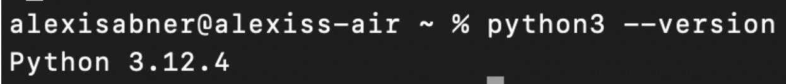
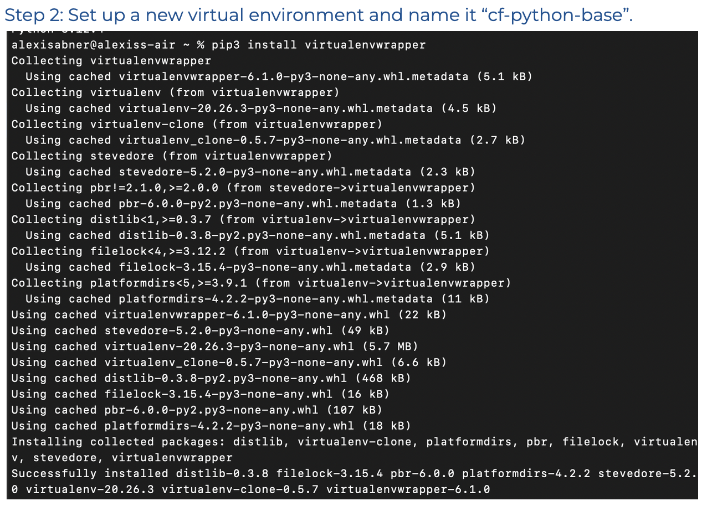
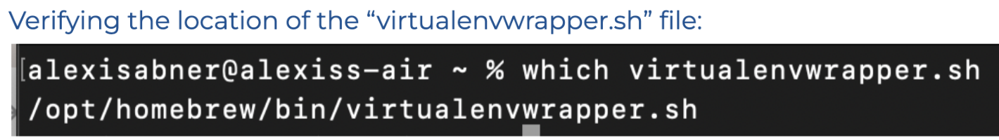
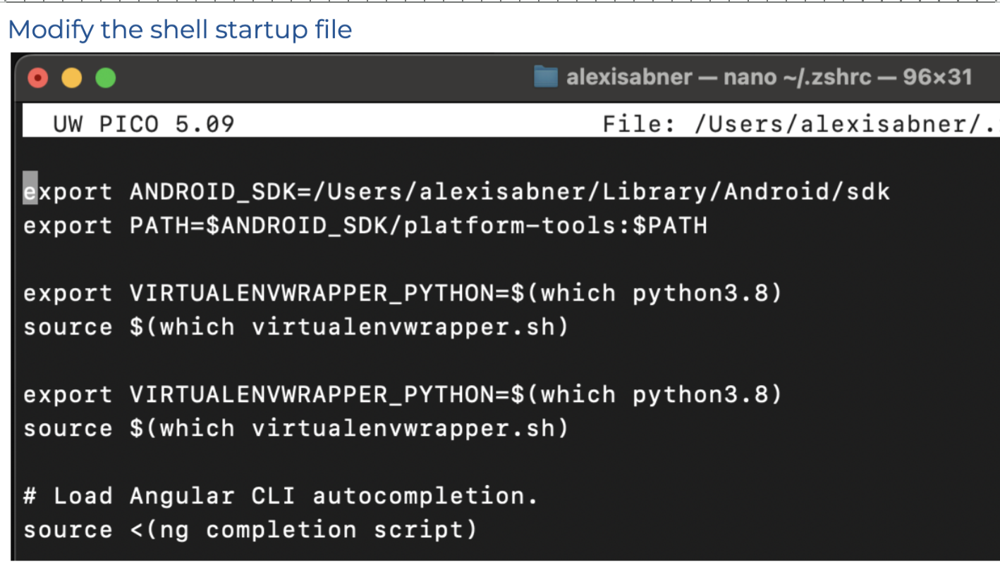
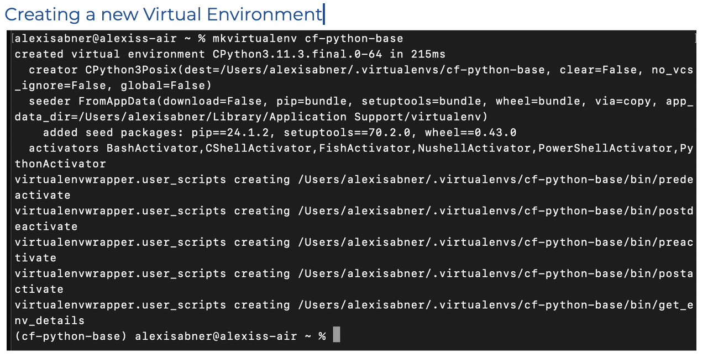
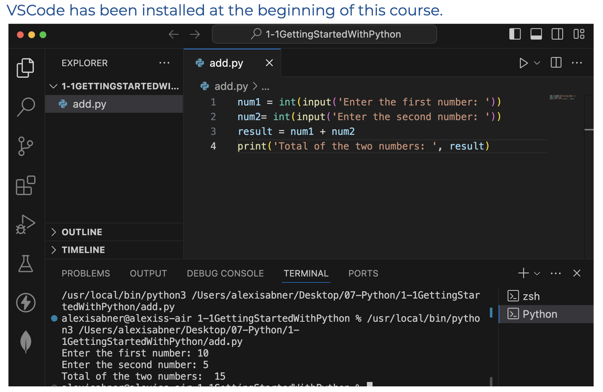
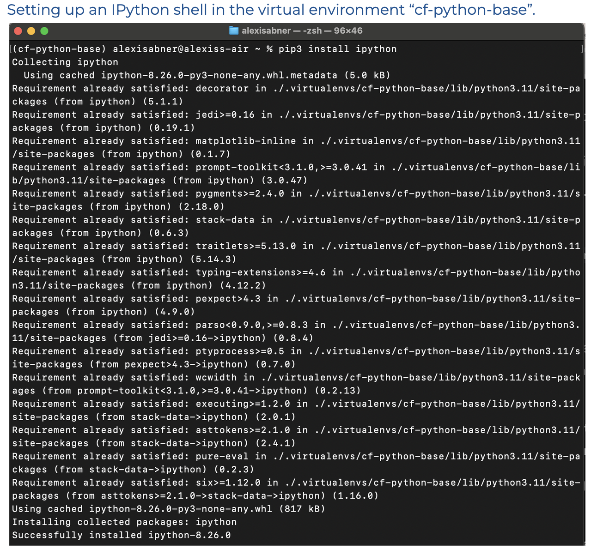
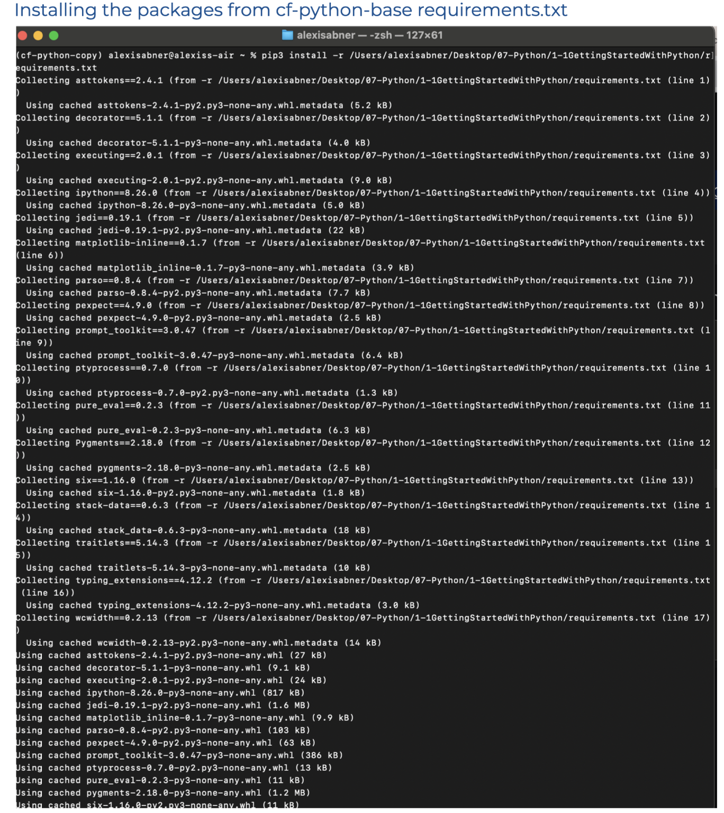

# Python
### Installation
Check whether you have Python installed with the following lines in your terminal.
``` 
 python --version
 python2 --version
 python3 --version
 ```
Python can be installed on a Mac via either Python’s official installer or the Homebrew package manager.  



### New Environment Setup
Command to setup a new environment; `pip3 install virtualenvwrapper`


Then verify the location of virtualenvwrapper.sh


### Modify the shell startup file
For Z Shell (macOS 10.15+):
`sudo nano ~/.zshrc`
Add the following lines at the bottom of the file:
```
export VIRTUALENVWRAPPER_PYTHON=$(which python3.8)
source $(which virtualenvwrapper.sh)
```

Close the editor with `Ctrl + X`, type `Y` and press Enter, then reload your modified shell startup file.
for Z Shell, it’s `source ~/.zshrc`



### Creating a Virtual Environment
Command `mkvirtualenv cf-python-base`



### VSCode


### Installing IPython
Command `pip3 install ipython`


### Adding `requirements.txt`
Command `pip3 freeze` to see the requirements on terminal,  
`pip3 freeze > requirements.txt` to create a txt file in the project directory


### Creating cf-python-copy and Installing the packages from cf-python-base


